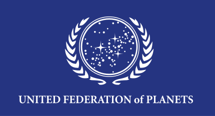

## API de planetas

Criar uma RESt API que vai fornecer as seguintes operações:
- Incluir um novo planeta;
- Listar os planetas existentes.;
- Calcular a distância entre dois planetas. A distância é calculada em anos-luz no espaço 3D;

### Dados do planeta:
- id
- nome
- x : coordenada x no espaço 3D | 0 > x <= 5000
- y : coordenada y no espaço 3D | 0 > y <= 5000
- z : coordenada z no espaço 3D | 0 > y <= 5000

##### Exemplo:
- Nome: Earth
- x: 202
- y: 104
- z: 1004

### Orientações:
Construir a API em:
- Java
- Kotlin
- Node.js

### Pontos por:
- Qualidade de código (clean code)
- Testes (Quanto mais, melhor!)

#### Ao finalizar, subir o projeto no github.
